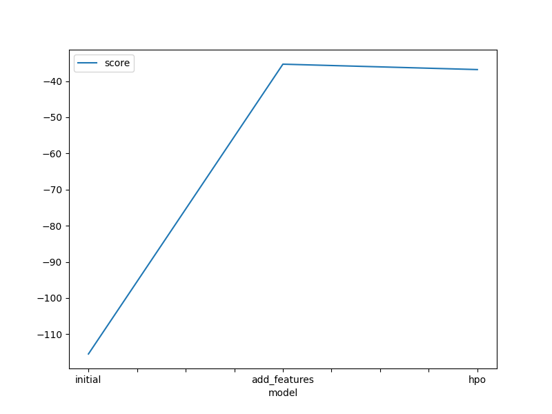
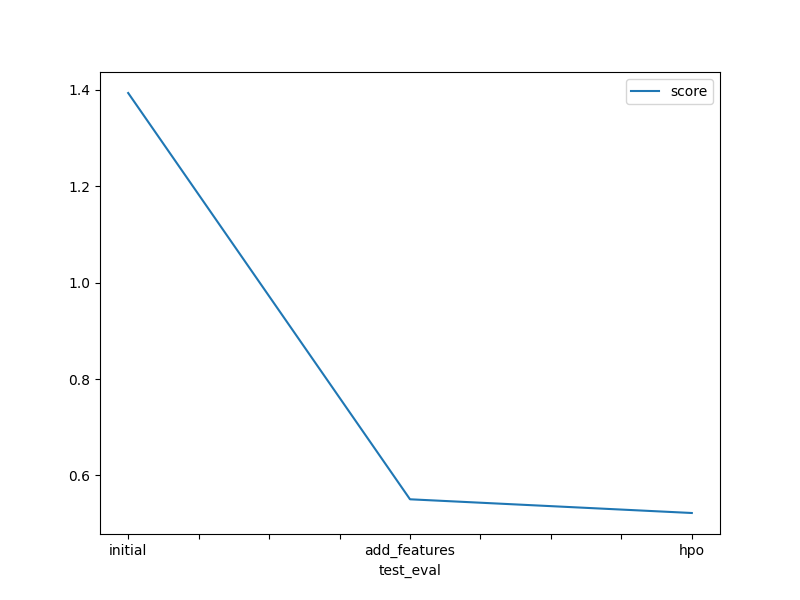

# Report: Predict Bike Sharing Demand with AutoGluon Solution
#### Muhammad Ahsan

## Initial Training
### What did you realize when you tried to submit your predictions? What changes were needed to the output of the predictor to submit your results?
After submitting the predictions, I realized that I need to do the EDA because the data is not in the right format. I need to convert the date to the right format and also need to convert the categorical data to the right format.

### What was the top ranked model that performed?
The top ranked model that performed was the `WeightedEnsemble_L2` model. The score was -36.804902. 

## Exploratory data analysis and feature creation
### What did the exploratory analysis find and how did you add additional features?
The exploratory analysis found that the data is not in the right format. I added additional features by converting the date to the right format and also need to convert the categorical data to the right format.

### How much better did your model preform after adding additional features and why do you think that is?
After adding additional features, the model performed better. The score was -36.804902. I think that is because the data is in the right format. After converting datetime to the right format and also converting the categorical data to the right format, the model can understand the data better.

## Hyper parameter tuning
### How much better did your model preform after trying different hyper parameters?
After trying different hyper parameters there was not much improvement in the model performance.

### If you were given more time with this dataset, where do you think you would spend more time?
If I were given more time with this dataset, I would spend more time on the Hyper parameter search and training time. I would also try to add more features to the dataset.

### Create a table with the models you ran, the hyperparameters modified, and the kaggle score.
|model|searcher|presets|time_limit|score|
|--|--|--|--|--|
|initial|none|best_quality|600|1.39352|
|add_features|none|best_quality|600|0.5504|
|hpo|auto|best_quality|600|0.52196|

### Create a line plot showing the top model score for the three (or more) training runs during the project.

TODO: Replace the image below with your own.

### Create a line plot showing the top kaggle score for the three (or more) prediction submissions during the project.

TODO: Replace the image below with your own.

## Summary
I tried to attempt the project in local windows machine so I encountered some issues with the unix command used in the notebook but I managed to get them to work. Furthermore I encountered some issues with the data format and the categorical data so I had to convert them to the right format, encountered some issues with the hyper parameter tuning so I had to try different hyper parameters.
